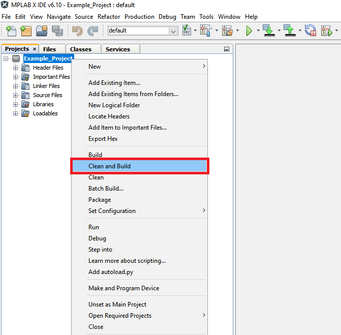

## I2C Host Read & Write EEPROM using PIC18F47Q10 with MCC Melody

This repository contains an example of a MCC-melody configured project for I2C as described in [TB3281 - Getting Started with I2C Using MSSP on PIC18](https://ww1.microchip.com/downloads/aemDocuments/documents/MCU08/ApplicationNotes/ApplicationNotes/Getting-Started-With-I2C-Using-MSSP-on-PIC18-90003281.pdf) document from Microchip.

The PIC18F47Q10 configured in I2C Host mode using the MSSP1 peripheral and performing read and write operations. This example will use the client [24LC02B](https://ww1.microchip.com/downloads/en/devicedoc/21709c.pdf), 2K I2C™ Serial EEPROM, addressed in 7-bit mode.

## Related Documentation

- [TB3281 - Getting Started with I2C Using MSSP on PIC18](https://ww1.microchip.com/downloads/aemDocuments/documents/MCU08/ApplicationNotes/ApplicationNotes/Getting-Started-With-I2C-Using-MSSP-on-PIC18-90003281.pdf)
- [PIC18-Q10 Product Family Page](https://www.microchip.com/design-centers/8-bit/pic-mcus/device-selection/pic18f-q10-product-family)
- [PIC18F47Q10 Data Sheet](http://ww1.microchip.com/downloads/en/DeviceDoc/40002043D.pdf)
- [24LC02B - 2K I2C™ Serial EEPROM](https://ww1.microchip.com/downloads/en/devicedoc/21709c.pdf)
- [PIC18F47Q10 Code Examples on GitHub](https://github.com/microchip-pic-avr-examples?q=pic18f47q10-cnano&type=&language=)

## Software Used

- [MPLAB® X IDE v6.10 or newer](http://www.microchip.com/mplab/mplab-x-ide)
- [MPLAB® XC8 2.41 or newer](http://www.microchip.com/mplab/compilers)
- [MPLAB® Code Configurator Melody](https://www.microchip.com/en-us/tools-resources/configure/mplab-code-configurator/melody)
- [PIC18F-Q_DFP Device Family Pack v1.20.405 or newer](https://packs.download.microchip.com/)

## Hardware Used

- PIC18F56Q71 Curiosity Nano Development board is used as a test platform.

 

- PICkit™ Serial I2C™ Demo Board [(PKSERIAL-I2C1)](https://www.microchip.com/DevelopmentTools/ProductDetails/PKSERIAL-I2C1)

## Operation

To program the Curiosity Nano board with this MPLAB® X project, follow the steps provided in the [How to Program the Curiosity Nano Board](#how-to-program-the-curiosity-nano-board) chapter.

## Setup

- **Clock Control:**
  - Clock Source: HFINTOSC
  - HF Internal Clock: 4 MHz
  - Clock Divider: 1

- **I2C Host:**
  - I2C Host PLIB Selector: MSSP1
  - Requested Speed: 100 kHz

- **UART:**
  - UART PLIB Selector: EUSART2
  - Redirect `printf` to UART: Enabled

- **Configuration Bits:**
  - WDT Operating Mode: Disabled
  - Low Voltage Programming Enable: Enabled

| Pin        | Configuration        |
| :--------: | :------------------: |
| RB1 (SCL1) | Weak Pull-up Enabled |
| RB2 (SDA1) | Weak Pull-up Enabled |
| RD0 (TX)   | Digital Output       |

The pull ups are enabled since the PICkit™ Serial I2C™ Demo Board comes without onboard pull-up resistors.

The following connections have to be made:
 

## Summary

This project is an illustration for a basic use case for writing and reading to and from an EEPROM using MSSP1 and MCC Meldoy.

## How to Program the Curiosity Nano board

This chapter shows how to use the MPLAB X IDE to program an PIC® device with an Example_Project.X. This can be applied for any other projects.

- Connect the board to the PC.

- Open the Example_Project.X project in MPLAB X IDE.

- Set the Example_Project.X project as main project.

  - Right click on the project in the **Projects** tab and click **Set as Main Project**.
     

- Clean and build the Example_Project.X project.

  - Right click on the **Example_Project.X** project and select **Clean and Build**.
     

- Select the **PICxxxxx Curiosity Nano** in the Connected Hardware Tool section of the project settings:

  - Right click on the project and click **Properties**
  - Click on the arrow under the Connected Hardware Tool
  - Select the **PICxxxxx Curiosity Nano** (click on the **SN**), click **Apply** and then click **OK**:
     

- Program the project to the board.
  - Right click on the project and click **Make and Program Device**.
     

 

- [Back to Setup](#setup)
- [Back to Summary](#summary)
- [Back to Top](#i2c-host-read--write-eeprom-using-pic18f47q10-with-mcc-melody)
